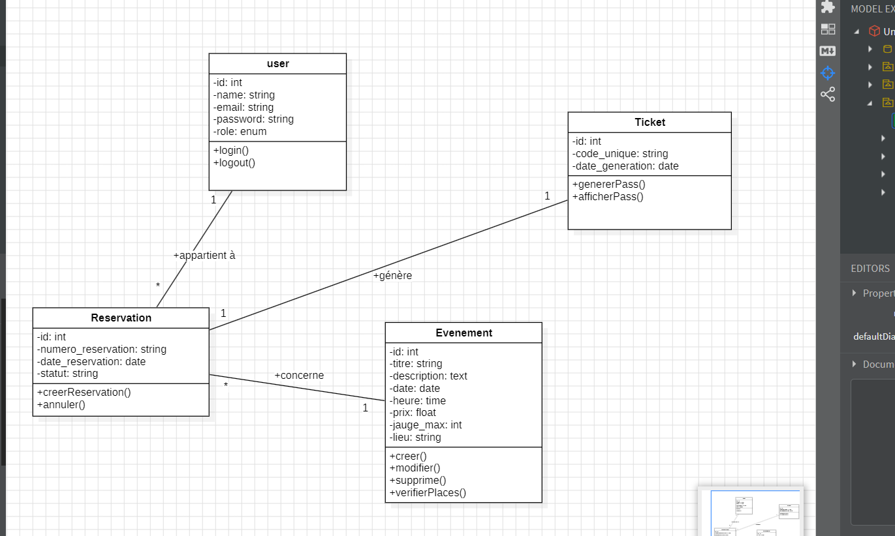

# 📊 Diagrammes

## Use Case Diagram


---

## Class Diagram



---

## Entity Relationship Diagram (ERD)


 BDE Events

## Description

BDE Events est une application Laravel permettant à l'administration du BDE de gérer les événements du campus et aux étudiants de réserver leur place en ligne et consulter leurs billets.

---

## Fonctionnalités

### Administration

- Authentification Admin
- Dashboard Admin
- Ajouter un événement
- Modifier un événement
- Supprimer un événement
- Consulter tous les événements
- Afficher les places restantes

### Étudiant

- Authentification
- Dashboard étudiant
- Voir les événements disponibles
- Réserver un événement
- Consulter Mes Billets

---

## Technologies

- Laravel 10
- PHP 8
- MySQL
- Bootstrap 5
- Blade
- Eloquent ORM

---

## Base de données

Tables principales :

- users
- events
- reservations

---

## Installation

```bash
git clone https://github.com/saradevlop7/BDE-Events-.git

cd BDE-Events

composer install

cp .env.example .env

php artisan key:generate

php artisan migrate

php artisan serve
```
---

## Comptes de test

### Admin

Email :

```
admin@gmail.com
```

Password :

```
123456
```

### Étudiant

Créer un compte puis connecter.

---

## Auteur

Sara Charafi
